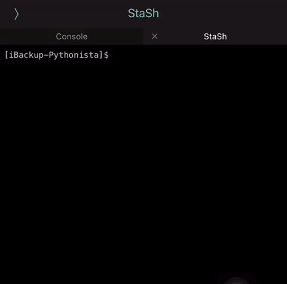

# iBackup-Pythonista.py - Create Backups of Python Scripts in Pythonista iOS App

Python script for backing up Pythonista scripts on iOS. Simple backups of Pythonista folders allowing easy transfer to other devices.




[iBackup-Pythonista](https://github.com/ConnerWill/iBackup-Pythonista)  was writted for the iOS app, Pythonista. Install [Pythonista](https://omz-software.com/pythonista) from the [iOS app store](https://apps.apple.com/us/app/pythonista-3/id1085978097).

## Features
* Easily create backups of all Pythonista scripts compressed to a zip archive.
* Simple configuration of backups using a configuration file.
* Share backup to prefered location.
* Exclude/include files and folders from being backed up.

## How To Use
### Installation

1. Download iBackup-Pythonista.py and and iBackup-Pythonista.cfg from this repository.
2. Edit configuration file (pythonista-backup.cfg) to your preference.
3. Run pythonista-backup.py to start the backup.

Alternatively, install [StaSH](https://github.com/ywangd/stash) and git clone this repository

```
$   git clone https://github.com/ConnerWill/iBackup-Pythonista.git
```
---

**This script is still a work in progress. Use this script at your own risk!**

*Tested on iPhone 7/8*

*iOS 15.0.1*

*Pythonista Version 3.3*
